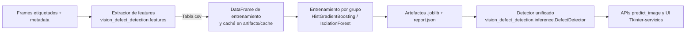
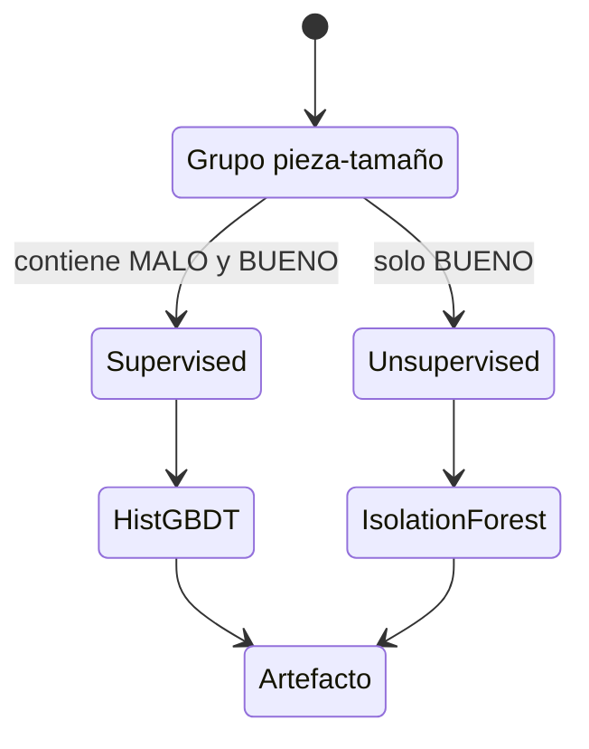
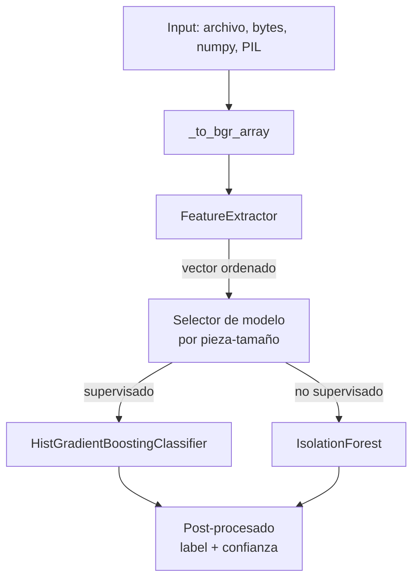

# Vision Defect Detection

Sistema completo para identificar piezas metálicas **BUENAS** o **MALAS** a partir de un solo frame. La solución cubre desde la preparación del dataset hasta la entrega del veredicto, empaquetando modelos entrenados, scripts de entrenamiento/evaluación y una UI de referencia.

## Objetivo y alcance

- Detectar defectos geométricos o de acabado en piezas de herrería usando imágenes RGB con iluminación controlada.
- Producir un identificador explainable: cada dictamen expone las métricas geométricas e intensidad que usó el modelo.
- Trabajar por tipo de pieza (`anillo`, `gancho`, `dobleanillo`, `ocho`, etc.) y por tamaño (`T1`, `T2`, …) para capturar las variaciones de diseño.
- Permitir modos supervisados (cuando existen ejemplos defectuosos) y no supervisados (cuando solo hay piezas buenas etiquetadas).

## Dataset e insumos

- Directorio raíz configurable (por defecto `processed/`).
- Estructura: `processed/<pieza>/<sample_name>/frame/*.png` con etiquetas embebidas en el nombre (`BUENO`/`MALO` + `Tx`) y opcionalmente `mask/*.png` con segmentaciones manuales.
- `vision_defect_detection.data.iter_frame_records` inspecciona todos los subdirectorios, aplica un **regex** `"(BUENO|MALO).*?(T\\d+)"` y construye un `FrameRecord` con metadatos (`piece_type`, `size`, `sample_id`, `frame_id`, rutas a frame/mask).
- Parámetro `--limit-per-sample` disponible en los scripts para acelerar experimentos o balancear muestras.

## Flujo general



## Extracción de características

1. **Segmentación automática (clase `Segmenter`):**
   - Conversión a escala de grises, blur gaussiano y umbral adaptativo (Otsu) para aislar la pieza.
   - Corrección automática si el área segmentada supera 50% (background invertido).
   - Operaciones morfológicas `CLOSE` y `OPEN` con kernels elípticos para rellenar huecos y limpiar ruido.
   - Selección del componente conexo más grande y descarte de máscaras con área menor a `min_area_ratio` (0.2% del frame) para evitar falsos positivos.

2. **Normalización espacial:** se reescala todo a `target_width=640` manteniendo relación de aspecto para que las medidas sean comparables entre cámaras o resoluciones.

3. **Cálculo de features:** `FeatureExtractor._compute_shape_features` genera un vector numérico puramente interpretable:

| Categoría | Métricas |
|-----------|----------|
| Área y ocupación | `area_ratio`, `bbox_coverage_ratio`, `bbox_aspect_ratio`, `minrect_ratio` |
| Propiedades convexas | `solidity`, `convex_defect_ratio`, `circularity`, `perimeter_area_ratio` |
| Huecos y topología | `hole_count`, `hole_area_ratio`, `mask_iou` (si hay máscara de referencia) |
| Forma avanzada | `eccentricity`, ratios de gap morfológico (`gap_ratio_5/11/19`) |
| Intensidad | `intensity_mean/std`, `background_mean/std`, `fg_bg_contrast` |
| Textura | `edge_density`, `laplacian_var` |

> Estas variables permiten explicar cada predicción (ej. “solidity baja + gap_ratio alto ⇒ posible deformación”).

La tabla completa de features se cachea en `artifacts/cache/frame_features.csv` para reutilizarla en entrenamiento y evaluación.

### Catálogo de indicadores y criterios

| Feature | ¿Qué mide? | ¿Por qué sirve? | Métrica de decisión |
|---------|------------|-----------------|---------------------|
| `area_ratio` | Porcentaje del frame ocupado por la pieza (0‑1). | Detecta faltantes o piezas sobredimensionadas. | Valores fuera del rango nominal del grupo activan al modelo; típicamente <0.15 o >0.35 sugiere anomalía. |
| `bbox_coverage_ratio` | Área segmentada ÷ área del bounding box mínimo. | Evalúa cuánto “rellena” la forma su caja; huecos internos reducen el ratio. | Reducciones >10% respecto al histórico indican material faltante. |
| `bbox_aspect_ratio` | Relación ancho/alto del bounding box. | Cada pieza tiene proporciones esperadas; torsiones alteran el ratio. | El modelo aprende límites superiores/inferiores (p.ej. ganchos T2 ≈1.6±0.1). |
| `minrect_ratio` | Área segmentada ÷ rectángulo rotado mínimo. | Detecta rotaciones o pliegues irregulares. | Disminuciones marcan deformaciones de borde. |
| `solidity` | Área ÷ casco convexo (0‑1). | Huecos o piezas dobladas bajan la solidez. | Valores <0.9 suelen indicar golpes. |
| `convex_defect_ratio` | Porción del casco que no ocupa la pieza. | Complementa a `solidity` resaltando cavidades. | Aumentos superiores al percentil 95 generan votos “MALO”. |
| `circularity` | (4π·área) ÷ perímetro². | Sensible a bordes irregulares; piezas circulares deben acercarse a 1. | Desviaciones negativas indican rebabas o cortes. |
| `perimeter_area_ratio` | Perímetro ÷ área. | Crece cuando hay intrusiones, cortes o ruido. | Si supera el umbral aprendido (≈>0.25 según grupo) indica defectos. |
| `hole_count` | Número de agujeros internos detectados. | Algunas piezas no deberían tenerlos. | Conteos inesperados (>0) marcan anomalías. |
| `hole_area_ratio` | Área total de agujeros ÷ área pieza. | Mide el tamaño relativo de los vacíos. | Ratios >0.05 implican rupturas. |
| `eccentricity` | Elipticidad calculada vía momentos (0‑1). | Usa la elongación para caracterizar ganchos y anillos. | Cambios bruscos (±0.1) respecto al patrón generan alerta. |
| `gap_ratio_{5,11,19}` | Diferencia de área tras morfología CLOSE de distintos radios. | Estima “gaps” o ranuras según el tamaño del kernel. | Aumentos simultáneos en kernels grandes sugieren aperturas o cortes. |
| `mask_iou` | IoU contra una máscara de referencia. | Verifica similitud con la etiqueta manual cuando existe. | Umbral de decisión ≈0.85; debajo se marca sospechoso. |
| `intensity_mean`, `intensity_std` | Media y desviación de grises dentro de la máscara. | Cambios de acabado o suciedad alteran la reflectancia. | Desviaciones >2σ del histórico disparan alerta. |
| `background_mean`, `background_std` | Estadísticas del fondo. | Detecta iluminación atípica que pueda invalidar la predicción. | Se usa para descartar frames en los que el fondo cambió demasiado. |
| `fg_bg_contrast` | Diferencia de intensidades pieza-fondo. | Asegura que la segmentación sea fiable. | Contrastres <20 niveles implican baja visibilidad. |
| `edge_density` | Pixeles de borde (Canny) ÷ área. | Rebabas generan más bordes por unidad de área. | Crecimientos fuertes contra la mediana del grupo marcan defecto. |
| `laplacian_var` | Varianza del filtro Laplaciano sobre la pieza. | Señala texturas irregulares o golpes (alta varianza) y desenfoque (baja). | Extremadamente alto o bajo se considera anómalo. |

> Los modelos usan estas métricas de forma combinada: cada árbol de `HistGradientBoosting` crea reglas del tipo “`solidity < 0.88` y `gap_ratio_11 > 0.12` ⇒ MALO”. En Isolation Forest se consideran outliers los vectores alejados del hiperespacio definido por las piezas BUENAS.

### Métrica de decisión global

- **Modelos supervisados:** se toma la probabilidad de clase `MALO` y se etiqueta como defectuosa si `proba ≥ 0.5` (umbral configurable). El `confidence` reportado corresponde al puntaje de esa clase o su complemento.
- **Modelos no supervisados:** usan el score de `IsolationForest` y un umbral derivado del percentil `anomaly_contamination` (5%). Scores por debajo del umbral se etiquetan como `MALO`, y la confianza se obtiene normalizando la distancia al límite.

## Estrategia de modelado

- **Entrenamiento por grupo**: cada combinación `pieza-tamaño` tiene su propio modelo. De esta forma, se capturan tolerancias específicas y se evita mezclar distribuciones incompatibles.
- **Selección del algoritmo** (`vision_defect_detection.modeling.train_group`):
  - **Supervisado** (`HistGradientBoostingClassifier`) cuando existen ejemplos BUENO/MALO. Se usan pesos balanceados, `max_depth=8`, `max_iter=400` y `train_test_split` estratificado (`test_size=0.2` por defecto).
  - **No supervisado** (`IsolationForest`) cuando solo hay piezas buenas. Se aprende la frontera normal y se fija el umbral como el percentil definido por `anomaly_contamination` (5% por defecto).
- **Requisitos mínimos:** al menos `min_samples=50` frames por grupo; de lo contrario se omite para evitar modelos inestables.
- **Reporte integrado:** se guarda `artifacts/models/report.json` con métricas por grupo (matriz de confusión, ROC-AUC, tamaños de train/test, estadísticos de anomalía).



### ¿Dónde entra el machine learning?

- Cada artefacto `.joblib` es un modelo de **aprendizaje automático** entrenado con los features numéricos descritos arriba. No son reglas fijas: `HistGradientBoostingClassifier` aprende umbrales y combinaciones no lineales directamente de los ejemplos BUENO/MALO para maximizar la separación entre clases.
- En grupos con solo BUENOS, se usa **Isolation Forest**, un algoritmo de detección de anomalías que construye múltiples árboles aleatorios y marca como defectuoso a cualquier vector de features que requiera pocos splits para aislarse (es decir, que se ve muy distinto al resto).
- Durante la inferencia (`DefectDetector.predict_from_features`) se arma el vector en el mismo orden de entrenamiento y se pasa al estimador correspondiente. El resultado trae:
  - `score`: probabilidad de `MALO` (modelos supervisados) o score de anomalía (Isolation Forest).
  - `confidence`: versión normalizada del score para interpretar la certeza del dictamen.
  - `label`: se calcula aplicando el **umbral aprendido** (0.5 para HistGB y percentil para Isolation Forest). Por lo tanto, **la decisión final siempre proviene del modelo de ML** que corresponde a la pieza/tamaño solicitado.

## Entrenamiento paso a paso

```bash
python3 -m venv .venv
source .venv/bin/activate
pip install -r requirements.txt

.venv/bin/python scripts/train_models.py \
    --data-root processed \
    --output-dir artifacts/models \
    --cache-file artifacts/cache/frame_features.csv \
    --report-file artifacts/models/report.json \
    --limit-per-sample 50            # opcional
```

- El script detecta automáticamente los grupos disponibles, recalcula (o reutiliza) el caché de features y exporta `*.joblib` con la siguiente estructura:

```text
{
  "piece_type": "gancho",
  "size": "T2",
  "model_type": "supervised" | "isolation_forest",
  "feature_names": [...],
  "estimator": <modelo sklearn>,
  "threshold": 0.5 | percentil anomalía,
  "metrics": {...}
}
```

## Evaluación y trazabilidad

```bash
.venv/bin/python scripts/evaluate_confusion.py \
    --models-dir artifacts/models \
    --cache-file artifacts/cache/frame_features.csv \
    --figure-path artifacts/models/confusion_matrix.png
```

- Reutiliza el caché para evitar re-extraer features.
- Ejecuta todos los modelos disponibles y genera:
  - Matriz de confusión global y métricas (`precision/recall/f1`) en consola.
  - Resumen por grupo (`muestras`, `accuracy`, `recall de defectos`).
  - Figura `.png` con la matriz global para informes.

## Inferencia e interfaces

- `vision_defect_detection.inference.DefectDetector` carga todos los `*.joblib` de un directorio y expone:
  - `predict_from_image(path, piece_type, size)` → ejecuta extracción de features + inferencia.
  - `predict_from_features(features, piece_type, size)` → útil si ya se tienen las métricas precalculadas.
- `vision_defect_detection.api.predict_image` es una fachada que acepta rutas, bytes, `numpy.ndarray` o `PIL.Image` y devuelve un dict con:

```text
{
  "piece_type": "gancho",
  "size": "T2",
  "label": "BUENO"|"MALO",
  "is_defective": bool,
  "confidence": float (0-1),
  "score": probabilidad o score de anomalía,
  "model_type": "supervised"|"isolation_forest",
  "features": {...},          # vector interpretado
  "input_shape": (h, w)
}
```

```python
from vision_defect_detection import predict_image

diagnostic = predict_image(
    "mi_frame.png",
    piece_type="gancho",
    size="T2",
)
print(diagnostic["label"], diagnostic["confidence"])
print(diagnostic["features"]["solidity"], diagnostic["features"]["gap_ratio_11"])
```

### Flujo de inferencia



### Árbol de decisiones completo

```mermaid
flowchart TD
    A[Imagen + pieza + tamaño] --> B[Extraer features normalizados]
    B --> C{¿Existe modelo para pieza-tamaño?}
    C -- No --> X[Error: modelo inexistente]
    C -- Sí --> D{Tipo de modelo}
    D -- HistGradientBoosting --> E[Calcular probabilidad clase MALO]
    E --> F{¿prob >= 0.5?}
    F -- Sí --> G[MALO<br>confidence = prob]
    F -- No --> H[BUENO<br>confidence = 1 - prob]
    D -- IsolationForest --> I[Calcular score de anomalía]
    I --> J{¿score < threshold?}
    J -- Sí --> K[MALO<br>confidence = sigmoide(score - threshold)]
    J -- No --> L[BUENO<br>confidence = sigmoide(threshold - score)]
    G --> M[Reporte final con métricas]
    H --> M
    K --> M
    L --> M
```

### Aplicación Tkinter de referencia

```bash
.venv/bin/python tk_app.py --models-dir artifacts/models
```

- UI para demo en planta: carga una imagen, selecciona pieza/tamaño, muestra el dictamen, score y los indicadores clave (`area_ratio`, `solidity`, `gap_ratio_11`, etc.).
- Útil para validar feedback con el equipo de calidad y documentar ejemplos.

## Artefactos empaquetados

- `dist/vision-defect-detection-*.tar.gz` incluye la librería + modelos por defecto (`src/vision_defect_detection/resources/models/*`), lo que permite instalarla en entornos offline (`pip install dist/...`).
- Los modelos entrenados manualmente van en `artifacts/models/` y pueden sustituir a los embebidos.

## Decisiones de diseño clave

- **Per-pieza/per-tamaño**: evita normalizar formas radicalmente distintas y conserva estándares de calidad específicos.
- **Features interpretables**: se priorizó geometría e intensidad sobre redes profundas para depurar fácilmente y trabajar con datasets pequeños.
- **Segmentación robusta pero simple**: umbral + morfología evita depender de anotaciones de máscara; cuando existen máscaras de referencia se puede forzar su uso con `--use-reference-mask`.
- **Modo híbrido supervisado/no supervisado**: no todas las piezas defectuosas están documentadas; Isolation Forest permite seguir detectando outliers y se calibra con scores históricos.
- **Artefactos auto descriptivos**: cada `.joblib` lleva metadata (`feature_names`, `metrics`) para auditar versiones y replicar experimentos.

## Próximos pasos sugeridos

1. Validación cruzada por pieza/video para evitar fugas temporales.
2. Augmentations ligeros (blur, ruido, rotaciones ±5°) para reforzar la invariancia a condiciones de cámara.
3. Ensambles especializados (forma vs. textura) para piezas con defectos sutiles.
4. Promediar features por muestra o ventana temporal para reducir variabilidad frame a frame cuando se disponga de secuencias.

Con esta documentación el proyecto queda trazable de punta a punta: qué datos se consumen, cómo se abstraen en features, qué algoritmos se usan y cómo se obtiene el dictamen que ve el usuario final.
